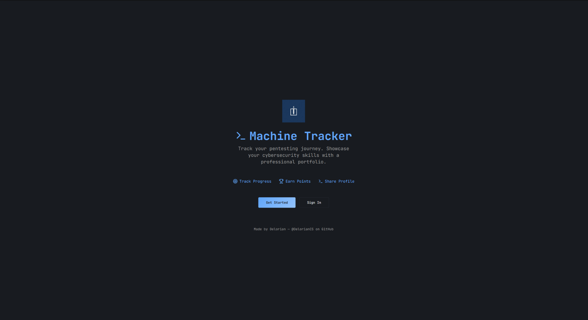
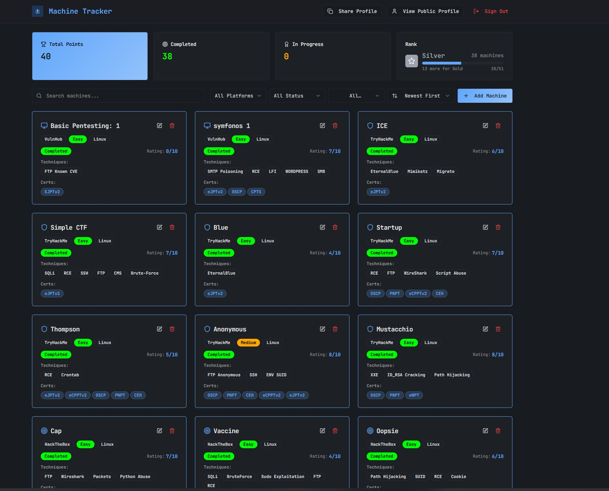

# Machine Tracker

**Machine Tracker** is a FREE minimalist web application that helps cibersecurity learners document and share their pentesting progress in a clean and structured way.

This tool is built for the community — no paywalls, ads, or locked features. Just a modern public portfolio system made for hackers by hackers

## Screenshots

### Landing Page

### Dashboard View

## 🔗 Try the App

 [https://machinetracker.lovable.app](https://machinetracker.lovable.app)

##  Key Features

###  Public Access & User Identity

- Register securely with **email + password**
- Uses **email-based MFA** for enhanced protection
- Each user creates a **username** and **display name**
- Every user has a **public profile URL** to showcase their work

### ⚙️ Machine Management

Manage all your lab machines from your private dashboard:

- Add, edit, delete machines
- Each machine includes:
 - Name
  - Platform (HackTheBox, TryHackMe, VulnHub, DockerLabs, PicoCTF)
  - Difficulty (Easy, Medium, Hard, Insane)
  - Operating System (Linux, Windows, Other)
  - Techniques used
  - Certifications (e.g., OSCP, PNPT)
  - Status (Completed, In Progress, Planned)
  - Personal Rating (0–10)

### 🏆 Points & Rankings

Earn points as you complete machines:

-  **Easy** → 1 pt  
-  **Medium** → 2 pts  
-  **Hard** → 3 pts  
-  **Insane** → 4 pts  

Your total score appears on your **dashboard** and **public profile**.

As you complete more machines, you level up through ranks:

| Rank         | Machines Completed |
|--------------|--------------------|
| 🪨 **Iron**        | 0–10               |
| 🥉 **Bronze**      | 11–25              |
| 🥈 **Silver**      | 26–50              |
| 🥇 **Gold**        | 51–80              |
| 💎 **Platinum**    | 81–120             |
| 🍀 **Emerald**     | 121–150            |
| 🔷 **Diamond**     | 151–170            |
| 🎯 **Master**      | 171–185            |
| 👑 **Grandmaster** | 186–199            |
| 🚀 **Challenger**  | 200+               |

Use rankings to **track your progress**, **stay motivated**, and **highlight your growth** in cybersecurity.

##  Credits

**Made by Delorian — [@DelorianCS on GitHub](https://github.com/DelorianCS)**
