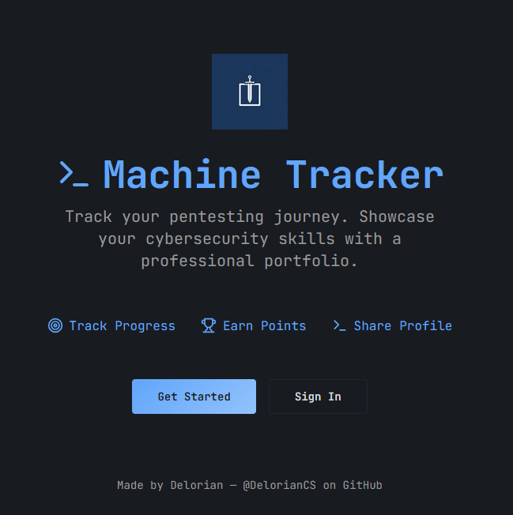

# Machine Tracker

**Machine Tracker** is a FREE professional and minimalist web application that helps cybersecurity learners document and share their pentesting progress in a clean and structured way.

This tool is built for the community — no paywalls, ads, or locked features. Just a modern public portfolio system made for hackers by hackers.

## 🖼️ Screenshots

### Landing Page

### Dashboard View

## 🔗 Try the App

👉 [https://machinetracker.lovable.app](https://machinetracker.lovable.app)

## ✨ Key Features

### ✅ Public Access & User Identity

- Register securely with **email + password**
- Uses **email-based MFA** for enhanced protection
- Each user creates a **username** and **display name**
- Every user has a **public profile URL** to showcase their work

### 🧠 Machine Management

Manage all your lab machines from your private dashboard:

- Add, edit, delete machines
- Each machine includes:
  - Name
  - Platform (HackTheBox, TryHackMe, VulnHub, DockerLabs, PicoCTF)
  - Difficulty (Easy, Medium, Hard, Insane)
  - Operating System (Linux, Windows, Other)
  - Techniques used
  - Certifications (e.g., OSCP, PNPT)
  - Status (Completed, In Progress, Planned)
  - Personal Rating (0–10)

### 🏆 Points & Rankings

- Earn points as you complete machines:
  - Easy → 1 pt
  - Medium → 2 pts
  - Hard → 3 pts
  - Insane → 4 pts
- Your total score is displayed on your dashboard and public profile
- Perfect for building your resume or LinkedIn presence

## 💬 Community

**Machine Tracker** is open to all cybersecurity learners and professionals.  
Use it to build your journey and inspire others with your progress.

## 🙌 Credits

**Made by Delorian — [@DelorianCS on GitHub](https://github.com/DelorianCS)**
